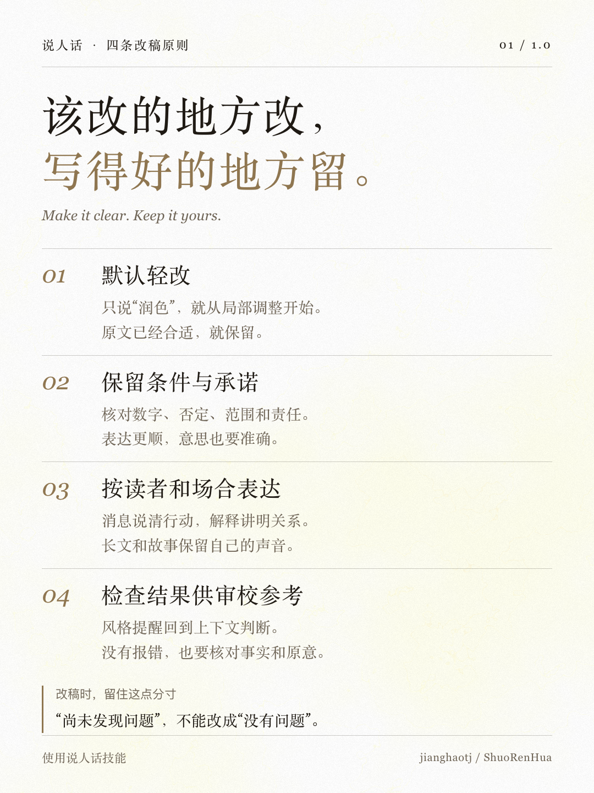

# 说人话 · ShuoRenHua

> 保留事实和原意，把中文写清楚，让表达符合读者和场合。


[](CHANGELOG.md)
[](LICENSE)
[](https://skills.sh/jianghaotj/ShuoRenHua)

「说人话」是一个中文写作与改稿技能，适用于日常沟通、工作消息、解释、摘要、分析、教程和叙事创作。

你可以交给它一段需要润色的文字，也可以提供材料，请它从头起草。只说“润色”时，默认轻改；原文已经合适，就保留。

本项目基于 [活人感写作 · human-writing](https://github.com/KKKKhazix/human-writing) 改进，延续对真实材料和自然中文的重视，进一步细化改稿范围、信息保留与不同场景下的写作方式。

## 它能做什么

| 你要做的事 | 它会重点处理什么 |
| --- | --- |
| 润色一段文字 | 修正不顺的表达，保留原意、语气和必要限定 |
| 写工作消息或邮件 | 说清对象、行动、责任和已有的时间要求 |
| 解释一个概念 | 按读者已有的知识解释术语，把关系讲明白 |
| 整理摘要 | 提取核心信息，保留影响结论的条件和范围 |
| 写分析或教程 | 组织依据、步骤和取舍，按需使用列表、表格与代码 |
| 写长文、故事或对白 | 保留叙述声音、人物视角和节奏，区分现实材料与虚构内容 |

它尤其关注改稿中容易丢失的信息，例如时间、数字、否定、条件、责任和承诺。

“尚未发现问题”不能改成“没有问题”；“可能有效”不能改成“明确有效”。文字更顺的同时，意思也应当准确。

<p align="center">
  
</p>

## 快速安装

把下面这段话发给支持安装技能的 AI Agent：

```text
帮我安装「说人话」技能：
https://github.com/jianghaotj/ShuoRenHua

请安装仓库中的 shuo-ren-hua 文件夹，并保留其中的参考文件、脚本和许可证。
```

也可以通过 [skills CLI](https://skills.sh/docs) 安装（需要 Node.js 和 npm）：

```bash
npx skills add jianghaotj/ShuoRenHua --skill shuo-ren-hua
```

跟随提示选择使用的工具和安装范围。顶部的安装量徽章来自 skills.sh，只反映其安装入口收集到的统计，不代表全部安装人数；手动复制或其他安装方式不计入。CLI 提供关闭匿名统计的选项，见其 [遥测说明](https://github.com/vercel-labs/skills#telemetry)。本技能不含自行收集写作内容或调用次数的统计代码。

如果你的工具不支持直接安装，可以下载仓库，将完整的 `shuo-ren-hua` 文件夹放入该工具的 Skills 目录。具体位置以工具的安装说明为准。

**在 Codex 中，用中文选择技能：**在输入框输入 `/`，搜索并选择「说人话」，再填写需求。这里的「说人话」是技能的中文显示名；不同工具的技能选择入口可能有所不同。

也可以直接用中文说明：

```text
使用说人话技能，轻度润色下面这段话。
保留事实、原意和语气，只修改不顺的地方。
```

```text
使用说人话技能，把这些材料整理成一条发给同事的工作消息。
说清当前进展、需要对方处理的事项和已有截止时间。
```

```text
使用说人话技能，向第一次接触这个概念的人解释它。
必要术语可以保留，但要讲清楚含义。
```

## 相比「活人感写作」，调整了什么

对照上游 [1.1.0 技能规则](https://github.com/KKKKhazix/human-writing/blob/4fda173f3fef7fb808f3eba991eeb2528ea4b189/human-writing/SKILL.md)，本项目主要做了以下调整：

| 方面 | 本项目的调整 |
| --- | --- |
| 默认写法 | 先判断任务、读者和场合，再选择适合的结构，不默认写成长帖 |
| 润色范围 | 明确区分轻改、重写、解释性改写和摘要；只说润色时默认轻改 |
| 信息保留 | 细化数字、条件、否定、范围、结论强度、责任、承诺及引用的保留要求 |
| 风格判断 | 允许必要的冒号、对比句和专业词，根据上下文判断是否影响理解 |
| 材料不足 | 按缺失信息的重要性决定补充、询问或缩小交付范围，不以固定材料数量作为开稿门槛 |
| 审校流程 | 短任务轻量处理；长文集中修订，必要时再做定点修复 |
| 检查工具 | 区分风格提醒、精确保留检查与无法自动判断的语义问题 |

这些调整服务于更广泛的日常写作与改稿任务。实际输出仍取决于模型、材料和提示要求。

## 可选的本地检查

技能附带一个本地文字检查器。需要检查长文时，可以在技能目录内运行：

```bash
python3 scripts/check_prose.py article.md --profile professional --format json
```

检查器只读、不联网、不调用模型，也不自动改稿。

它可以提示部分风格问题，并在提供明确约束时检查指定文字是否原样保留。它不能独立判断事实真假、引用是否支持结论，或改写是否完整保留了语义。没有报错也不等于文章可以直接发布。

日常短消息和轻度润色不需要运行检查器。

## 仓库结构

```text
ShuoRenHua/
├── README.md
├── LICENSE
├── CHANGELOG.md
├── assets/
└── shuo-ren-hua/
    ├── SKILL.md
    ├── LICENSE
    ├── agents/
    ├── references/
    │   ├── editing.md
    │   ├── plain-language.md
    │   ├── reality.md
    │   ├── formats.md
    │   ├── forum-prose.md
    │   ├── fiction.md
    │   ├── revision.md
    │   ├── rules.json
    │   └── examples/
    └── scripts/
        ├── check_prose.py
        ├── check_contract.py
        └── prose_blocks.py
```

`SKILL.md` 是技能入口；`references/` 提供按需读取的规则和示例；`scripts/` 提供可选检查工具。

## 问题反馈

遇到改写失真、过度润色、规则冲突或检查器误报，欢迎 [提交 Issue](https://github.com/jianghaotj/ShuoRenHua/issues)。

请尽量提供：

- 使用的工具、模型和技能版本。
- 提示词与必要的原文片段。
- 实际输出，以及你希望保留或调整的内容。
- 如果涉及检查器，附上命令和相关报告。

提交前请移除个人隐私和公司内部信息。

## 致谢与许可

本项目基于 [KKKKhazix/human-writing](https://github.com/KKKKhazix/human-writing) 改进，感谢上游作者与贡献者。

技能规则、文档和脚本采用 [MIT 许可证](LICENSE)，保留上游版权与许可声明。第三方素材如有单独许可，以对应说明为准。

卡片使用 [Guizang Social Card Skill](https://github.com/op7418/guizang-social-card-skill) 制作，制作工具采用 AGPL-3.0，未作为技能依赖分发。图片的制作来源见 [assets/SOURCES.md](assets/SOURCES.md)。

「说人话」用于改善表达，不用于规避 AI 检测或伪造真人经历。
